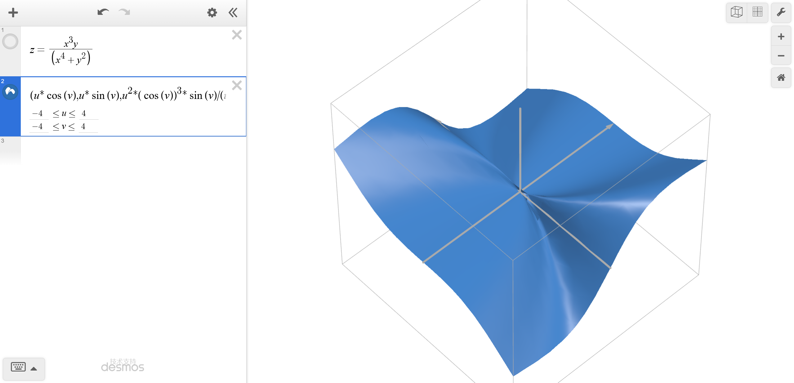
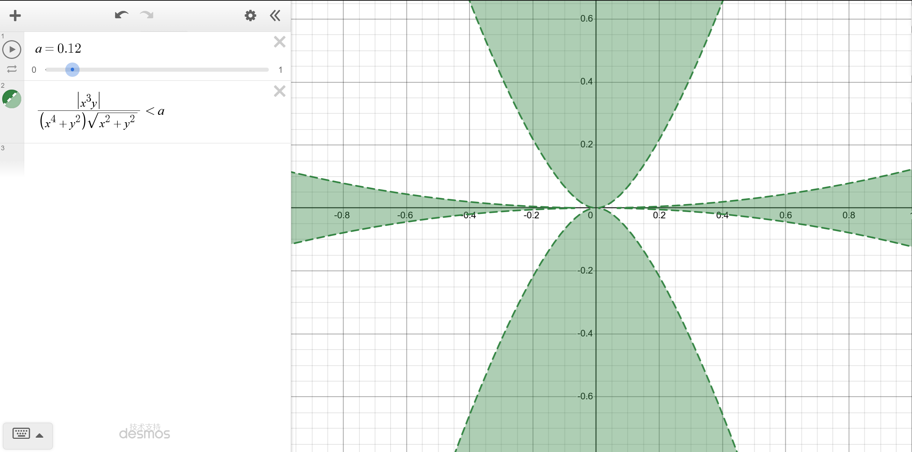
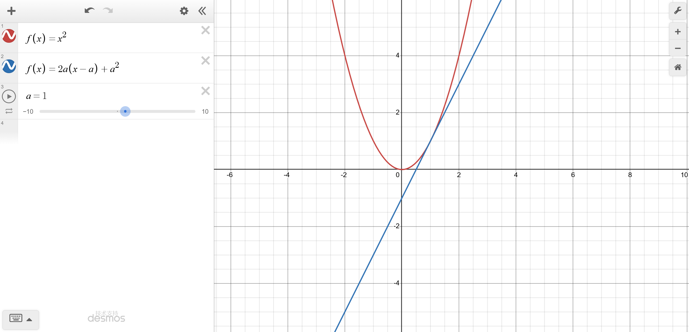
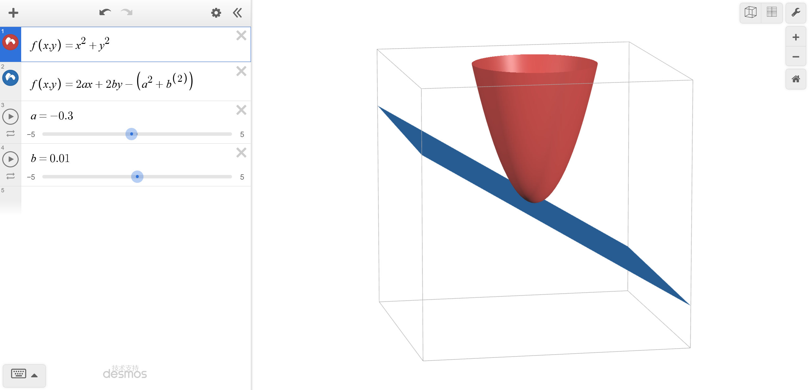

### 一元函数微分

微分的本质是，给定**点**及其**邻域**，研究邻域内的所有点能否**线性近似**。

标准微分的**邻域**是定义在N维度流形上的，也就是这个点**局部同胚**于一个N维球（N维欧几里得空间），这个点叫正则点，这样就可以通过**参数化**来使得定义域就是一个直线，平面，或者长方体。

(同胚是连续映射的拓扑学表述，要定义连续还得定义空间和点是什么，实数和度量是什么，当然这是写给自己看的，懂得都懂)

反例：比如两个相交平面的交线处（有所谓的奇点，可以通过所谓的奇点消解来研究微积分性质），比如一个无处稠密的函数（拓扑性质最差）

定义 $ \Delta y=f(x+ \Delta x)-f(x)$  如果 $\Delta y = A \Delta x +o( \Delta x) $那么 $dy=Adx$

同样的定义$dy=f’xdx$ 如果在一个邻域内A值都存在，那么A值就可以是x值的函数，从而定义一个函数

$A(x)=f'_x(x)=y_x(x)$

如何区分$f'(x)$和$y'_x$？事实上，我们必须要有一个自变量，一个因变量，而函数不是变量,光看写法,只是$f(x0)=...$，$f(x1)=...$，但是可以当成一个匿名变量，事实上，对于$f(x)$，我们默认相当于定义一个匿名因变量，自变量是$x$，注意后面我们知道，只有确定自变量才能得到所谓的$f^n(x)$。

刚才的例子中只有两个变量，一个自变量x，一个因变量y，但是如果是

$y=x^2-z^2$

那么dy/dx是什么？ lim x->x0 f(x)-f(x0)/x-x0 是什么？你会发现一个问题，如果x-x0的路径不同，那么这个极限的值也会不同，这就轮到下面要讨论的多元函数微分了

### 多元函数微分

微分的本质是线性近似。我们有

$$
\Delta z = f(x+\Delta x, y+\Delta y)- f(x,y)
$$

一元函数用切线近似，二元函数自然是用切平面近似，那么

$$
\Delta z = A\Delta x + B\Delta y + o(?)
$$

这个作为误差的无穷小项到底长什么样？

一个想法是：在充分小的区域内，随便选两个不共线的方向作为基向量，求出沿这两个方向的平均斜率，用它们搭一个“临时切平面”。然后要求：对区域内所有其他方向，这个临时平面预测的斜率与真实斜率的差，要随着区域缩小而越来越小。注意，我们根本没去求偏导数——随便选两个方向做基准，本质上是柯西极限判别，这和一般的极限定义完全等价，只不过柯西判别不需要提前知道极限值到底是多少。

事实上，如果$\Delta z = A\Delta x + B\Delta y + o(?)$确实成立，那两个方向上的偏导数就是A和B，但是这是后话。

无穷小项长什么样，以及，两个变量，到底该怎么“逼近”？

直觉是这样的：在一个充分小的区域内，建立一个坐标轴，在这个坐标轴内曲面看起来像一个平面，误差越来越小。也就是当这个区域足够小的时候，把它放大再看，曲面上的所有点应该越来越平。

注意，我们要求的是**所有方向**的邻域内，误差都是某个函数的高阶无穷小量，而不是只在部分方向上成立。给定一个邻域范围，可以求出误差的最大值（也就是预测斜率与真实斜率之差的最大值），要求这个最大值随着邻域缩小而趋于零。

但这时最要命的问题来了。如果只有一个$\Delta x$，所有邻域的大小可以有自然的数值顺序；二维却不行。我们甚至连“邻域变小”意味着什么都说不清。一个退而求其次的好想法是：如果邻域$P$完全包含邻域$Q$，就说$Q$比$P$小。但如果$P$和$Q$有不相交的部分，就很尴尬了。那我们干脆只考虑能互相包含的邻域序列：要求对任何一个“一个套一个”并且缩向该点的邻域递减序列，误差都越来越小。这样，极限的存在性就可以用包含关系来保证。

然而，就算有了邻域递减序列，我们还是不知道“误差越来越小”到底是相对于什么而言的。事实上，我们希望把所有邻域都放大到同等规模，然后再看误差——这才是真正的“越来越小”。可这些邻域形状不一定一样！哪怕按某个比例放大，也不一定能完全重合。

于是，我们继续加限制：**只要对同一个形状的邻域，让它越来越小，误差越来越小就行。**可以证明，如果对某些“良好”形状的邻域递减序列误差越来越小，那么对任何形状的邻域递减序列，误差也都会越来越小。

那么，什么样的表达式能决定一个邻域的形状？以下是一些例子：

- $\max(|\Delta x|,|\Delta y|)\le t$——正方形
- $|\Delta x|+|\Delta y|\le t$——斜着的正方形（菱形）
- $|\Delta x|+2|\Delta y|\le t$——长方形
- $\sqrt{\Delta x^2 +\Delta y^2}\le t$——圆
- $\min(|\Delta x|,|\Delta y|)\le t$——无界，出局
- $|\Delta x|\cdot |\Delta y|\le t$——无界，出局
- $\Delta x^2 +\Delta y^4 \le t$——一个有界的“操场形”

误差要在“线性近似”的意义下越来越小。假设我们把一个标准形状的大邻域等比例缩小，小邻域是大邻域的$1/n$（长度缩小为$1/n$，面积自然缩小为$1/n^2$），并设大邻域上的最大误差为$B$，小邻域上的最大误差为$A$。那么“单位尺度上的误差在减小”就应该写成：

$$
A \cdot n < B \quad\text{也就是}\quad \frac{A}{1/n}< \frac{B}{1}
$$

要真正达到局部平面化，这个比值可以小于任意正数。因此我们要求：

$$
\lim_{\rho \to 0}\frac{A(\rho)}{\rho}= 0
$$

这里$\rho = 1/n$就是小邻域相对于标准形状的**线性缩放倍数**，也就是我们一直寻找的那个“尺度”。于是，误差的样子被逼了出来：**它是线性尺度$\rho$的高阶无穷小，记作$o(\rho)$。**

现在，如果用来定义形状的那个二元函数$N(\Delta x,\Delta y)$不仅圈出了邻域（$N(\Delta x,\Delta y)\le t$），还恰好满足：把坐标放大$n$倍时，函数值也严格放大$n$倍，即

$$
N(n\Delta x, n\Delta y)= n N(\Delta x,\Delta y),
$$

那么，线性尺度$\rho$就恰好等于函数值$N(\Delta x,\Delta y)$。此时，我们便有

$$
o(N(\Delta x,\Delta y))= o(\rho).
$$

这样，一个具有一次齐次性的二元函数，不仅能决定邻域的形状，还能直接决定误差的阶。整个定义统一为：

$$
\Delta z = A\Delta x + B\Delta y + o(N(\Delta x,\Delta y))
$$

$N$可以是$\sqrt{\Delta x^2 +\Delta y^2}$，可以是$\max(|\Delta x|,|\Delta y|)$，也可以是$|\Delta x|+2|\Delta y|$……只要它能定义一个有界、包含原点的邻域，并且在缩放时自身也线性缩放。

另一个角度，其实也可以反过来想，给定一个越来越小的误差$\varepsilon$，你至少必须画出一个邻域，使得邻域内所有误差都小于$\varepsilon$。这个邻域必须在所有方向上的半径都不是0，否则就说明这些地方永远是凸起或者凹陷的（因为误差太大）

比如$ z = \frac {x^3y}{x^4+y^2} $的图像是这样的

研究误差小于a的邻域长什么样

可以发现，方向越是靠近x轴，r越小，但是一旦方向就是x轴，那么r瞬间又不是0了，非常奇怪，对吧？

设方向角为 $\theta$，常数为 $A,B$，定义**斜率差**（$r>0$）：

$$
E(r,\theta)=\frac{f(r\cos\theta,\,r\sin\theta)-f(0,0)}{r}-(A\cos\theta+B\sin\theta)
$$
对任意 $\varepsilon>0$，定义该方向的**有效半径**：

$$
R_\varepsilon(\theta)=\sup\Big\{\delta>0\;\Big|\;\forall\,r\in(0,\delta),\ |E(r,\theta)|<\varepsilon\Big\}
$$
则 $f$ 在原点可微（且此时必有 $A=f_x(0,0),B=f_y(0,0)$）的充要条件是：

$$
\forall\varepsilon>0,\quad \inf_{\theta\in[0,2\pi)} R_\varepsilon(\theta) 0
$$

关键来了：如果我们把$R_\varepsilon(\theta)$代入到那个定义，就是
$$
\forall\varepsilon>0,\quad \inf_{\theta\in[0,2\pi)} \sup\Big\{\delta>0 \;\Big|\; \forall\,r\in(0,\delta),\ |E(r,\theta)|<\varepsilon\Big\} 0
$$

这里就是tricky的地方，Inf R(θ) 0 和 ∀θ, R(θ) 0不一样，这就是逐点收敛和一致收敛的关键区别。第一种定义的表述是
$$
\forall\varepsilon>0,\;\exists\delta>0,\;\forall\theta \in[0,2\pi),\;\sup_{r\in(0,\delta)}|E(r,\theta)|<\varepsilon
$$
这两个是一样的，原因懒得写了。一般来说，更喜欢使用第一种表述，可以写成无穷小语言，而第二种一致收敛的语言比较难以简写。

总结，我们从两种角度研究了局部线性近似到底是个啥，现在我们确立了切平面近似是使用
$$
\Delta z = A\Delta x + B\Delta y + o\left(\sqrt{\Delta x^2 + \Delta y^2}\right)
$$

如果存在 $A$、$B$ 使得这个公式成立，那么我们就可以写

$$
\mathrm{d}z = A\mathrm{d}x + B\mathrm{d}y
$$

这个式子叫做所谓的全微分。事实上，A和B的值被称为偏微分，即考虑如果这个式子成立，那么考虑下面两个函数

z(x,y0)和z(x0,y)

在(x0,y0)点分别对x和y求导数，得到的值被称为**偏导值**，

### 隐函数微分

在教科书的示例中，我们可以对隐函数做某些神奇的操作，比如

$x^2+y^2=1$

可以左右微分得到

$2xdx+2ydy=0$

而且还可以平移，得到

$\frac{dy}{dx} = - \frac {x} {y}$

有些教科书给的解释是，可以看成x y进行参数化，所以$x=f(t) ,y=g(t)$ 那么上述等式其实是对t微分，得到
$2x \frac {dx}{dt} dt + 2y \frac {dy}{dt} dt = 0$

所以才有

$2xdx+2ydy=0$

首先，这里的对x y进行参数化值得商榷，其次，如果是这样的式子

$x^2+y^2+z^2=1$

看似你也可以参数化$x=f(t) ，y=g(t)，z=h(t)$ 来解释，但是这里的大问题就在于，只有关t的参数化只会得到一个曲线，到那时这个公式明显描述了一个球曲面！所以你应该参数化为$x=f(u,v) ,y=g(u,v)，z=h(u,v)$，于是

$$dF = \left(2f\frac{\partial f}{\partial u} + 2g\frac{\partial g}{\partial u} + 2h\frac{\partial h}{\partial u}\right)du + \left(2f\frac{\partial f}{\partial v} + 2g\frac{\partial g}{\partial v} + 2h\frac{\partial h}{\partial v}\right)dv$$

$$= 2f\!\left(\frac{\partial f}{\partial u}\,du + \frac{\partial f}{\partial v}\,dv\right) + 2g\!\left(\frac{\partial g}{\partial u}\,du + \frac{\partial g}{\partial v}\,dv\right) + 2h\!\left(\frac{\partial h}{\partial u}\,du + \frac{\partial h}{\partial v}\,dv\right)$$

$$= 2f\,dx + 2g\,dy + 2h\,dz $$

$$= 2x\,dx + 2y\,dy + 2z\,dz$$

所以

$$x\,dx + y\,dy + z\,dz = 0$$

但是对于这样的式子

$(x-y)^2+(y-z)^2+(x-z)^2 = 0$

就非常奇怪了，因为它不能参数化为$x=f(u,v) ,y=g(u,v)，z=h(u,v)$，强行微分会得到 0 = 0，但是这是一个直线，显然有

$x=y=z$

一般来说，这里有两个重要的问题，一是，凭什么，以及如何参数化？二是，这里的dx到底是自变量还是因变量，你在随便左右移动，但是我们对d符号的定义是严格区分自变量和因变量的。

一般来说，通用的隐函数如下，给出一个F

$F(x,y,z)=0 \Rightarrow z=f(x,y)$

要求在一个局部领域内，给出固定的$x$和$y$都只有一个$z$值，注意，不要理解为局部内，$z$的一个固定值只能映射到唯一的$x=x_0$、$y=y_0$，不要求局部是**单射**的，但是要求局部是**单值**的，这样，我们其实就是默认隐函数是存在的，但是不假设其他性质（隐函数连续吗？可微吗？）

仅仅要求$(x_0,y_0)$这一个点上$z$唯一，虽然保证了$f(x_0,y_0)$只有一个值，但是我们需要的是函数，而函数不是定义在一个点，也不是定义在一条直线（这是二元函数），而是一个邻域，所以要求是局部邻域。有了这个公式，我们尝试微分

$$dF=Adx+Bdy+Cdz=0$$

看起来这里的$dx$，$dy$，$dz$可以随便移动，那么就有

$$dz=-\frac{A}{C}dx-\frac{B}{C}dy$$

考虑隐函数$z$的全微分定义

$$dz=f_xdx+f_ydy$$

那么是否有$f_x=-\frac{A}{C}, f_y=-\frac{B}{C}$？这并不是显然的，你凭什么可以把$dz$移动到右侧？你第一个公式的$dx,dy,dz$只是相互无关的当作自变量的微分，而第二个公式中$dz$是一个因变量，你如何确保，两个公式中$dz$的概念是一样的？这需要严格的证明。

#### 隐函数存在定理

如果$F$的偏导数在某一点$P$都是连续的，而且$F_z$不为$0$，那么$F(x,y,z)=0$在$P$的局部中，$z$是单值的，所以$z$是$x,y$的隐函数，即$z=f(x,y)$

首先，可以知道$F$在这一点连续；其次，如果假设$F_z$连续而且$F$连续，那么对于任意充分小的三维球局部，$z$都存在而且是单值的。因为

1.$F_z$连续导致在$\Delta z$充分小的时候，零点最多只有一个，所以$z$是单值的

2.$F$连续导致任意充分小的局部，都有$\Delta x,\Delta y$使得$z_0+\Delta z=f(x+\Delta x,y+\Delta y)$

#### 隐函数可微定理

设$F(x,y,z)$在点$P_0=(x_0,y_0,z_0)$可微，而且z是局部单值的（即对于任意充分小的三维球局部，z都存在而且是单值的，即隐函数存在），$F(P_0)=0$，且$F_z(P_0)\neq 0$。取任意满足约束$F=0$的增量$(\Delta x,\Delta y,\Delta z)$，即
$$
F(x_0+\Delta x, y_0+\Delta y, z_0+\Delta z)- F(x_0,y_0,z_0)= 0.
$$

事实上，这意味着

由全微分定义（精确到一阶）：
$$
0 = F_x \Delta x + F_y \Delta y + F_z \Delta z + o(\rho_3),\tag{1}
$$
其中
$$
\rho_3 = \sqrt{\Delta x^2+\Delta y^2+\Delta z^2},\quad \frac{o(\rho_3)}{\rho_3}\to 0 \quad (\rho_3 \to 0).
$$

解出$\Delta z$（因为$F_z\neq 0$）：
$$
\Delta z = -\frac{F_x}{F_z}\Delta x -\frac{F_y}{F_z}\Delta y -\frac{o(\rho_3)}{F_z}.\tag{2}
$$

令
$$
\rho_2 = \sqrt{\Delta x^2+\Delta y^2},\quad X = \frac{\rho_3}{\rho_2},\quad C = \frac{|F_x|+|F_y|}{|F_z|},\quad \eta = \frac{|o(\rho_3)|}{|F_z|\rho_3}.
$$

**第一步：证明$\rho_2 \to 0$时$\eta \to 0$**

因为对于任意充分小的三维球的局部，隐函数都存在，所以当$\Delta x \to 0,\Delta y \to 0$时，对应的$\Delta z \to 0$。

由于$\rho_2 \to 0$，即$\Delta x \to 0,\Delta y \to 0$，由连续性得$\Delta z \to 0$，进而$\rho_3 = \sqrt{\rho_2^2 +\Delta z^2}\to 0$，所以$\frac{o(\rho_3)}{\rho_3}\to 0$，因此
$$
\eta = \frac{|o(\rho_3)|}{|F_z|\rho_3}\to 0
$$

**第二步：证明$\frac{\rho_3}{\rho_2}$有界**

对(2)取绝对值：
$$
|\Delta z|\le C \rho_2 +\eta \rho_3.\tag{3}
$$
除以$\rho_2$，注意$X = \rho_3/\rho_2$：
$$
\frac{|\Delta z|}{\rho_2}\le C +\eta X.
$$
于是
$$
X = \frac{\rho_3}{\rho_2}= \sqrt{1 +\frac{\Delta z^2}{\rho_2^2}}\le \sqrt{1 +(C +\eta X)^2}.
$$
利用不等式$\sqrt{1+t^2}\le 1 +|t|$，且$C\ge 0, X\ge 0$：
$$
X \le 1 + C +\eta X.
$$
移项：
$$
(1 -\eta) X \le 1 + C.
$$
因为$\eta \to 0$，当$\rho_2$充分小时，$\eta < \frac12$，所以
$$
X \le \frac{1+C}{1-\eta}\le 2(1+C),
$$
即$X = \frac{\rho_3}{\rho_2}$有界。

**第三步：证明余项投影为高阶无穷小**

由上述有界性：
$$
\frac{o(\rho_3)}{\rho_2}
= \frac{o(\rho_3)}{\rho_3}\cdot \frac{\rho_3}{\rho_2}
= \left(\frac{o(\rho_3)}{\rho_3}\right) X.
$$

因为$\frac{o(\rho_3)}{\rho_3}\to 0$，而$X$有界，所以$\frac{o(\rho_3)}{\rho_2}\to 0 \tag{4}$，即有
$$
o(\rho_2)= o(\rho_3)\tag{4}
$$

**第四步：写出全微分形式**

由(2)和(4)：
$$
\Delta z = -\frac{F_x}{F_z}\Delta x -\frac{F_y}{F_z}\Delta y + o(\rho_2).\tag{5}
$$
根据全微分的定义，若函数$z = \varphi(x,y)$在点$(x_0,y_0)$可微，则其增量必须满足
$$
\Delta z = \varphi_x \Delta x +\varphi_y \Delta y + o(\rho_2).
$$
比较(5)可知隐函数$z = \varphi(x,y)$存在且可微，并且
$$
\varphi_x = -\frac{F_x}{F_z},\quad \varphi_y = -\frac{F_y}{F_z}.
$$
因此其微分满足：
$$
dz = \varphi_x dx +\varphi_y dy = -\frac{F_x}{F_z} dx -\frac{F_y}{F_z} dy.
$$
整理得：
$$
F_x dx + F_y dy + F_z dz = 0 \tag{6}
$$

从约束$\Delta F=0$的精确增量等式出发，我们证明了三维余项$o(\rho_3)$除以其投影二维模长$\rho_2$仍趋于0，从而余项在投影后确实是高阶无穷小。于是$\Delta z$的表达式完全符合二元函数全微分的定义，隐函数可微，微分形式(6)成立。

上述证明使用三个条件（一点可微，z任意局部单值,Fz不为0），证明了如果隐函数存在那么隐函数在这一点必可微，而且构成的等式就是隐函数为0时左右侧求微分得到的微分等式。所以，只要满足隐函数定理的条件，隐函数求全微分后的dx,dy,dz可以重新解释为对应隐函数的全微分，而不是相互独立的自变量。

#### 隐函数可微定理（$C^1$）

如果$F$是$C^1$的（所有的偏导数存在而且连续），那么不需要估计无穷小的阶，直接通过中值定理得到隐函数的可微性。

设$F(x,y,z)$在$P_0=(x_0,y_0,z_0)$的某邻域内偏导数连续（即$F\in C^1$），$F(P_0)=0$，且$F_z(P_0)\neq 0$。

由隐函数存在定理，$F\in C^1$保证了在$P_0$的某邻域内隐函数$z=\varphi(x,y)$存在、单值且连续（$F_z$连续保证局部单值，$F$连续保证存在性）。

现证$\varphi$在$(x_0,y_0)$可微。取充分小的$\Delta x,\Delta y$，令$\Delta z = \varphi(x_0+\Delta x,y_0+\Delta y)-z_0$，满足
$$
F(x_0+\Delta x, y_0+\Delta y, z_0+\Delta z)- F(x_0,y_0,z_0)= 0.
$$

将左边视为三元函数的增量。由多元拉格朗日中值定理，存在线段上的一点
$$
\xi = (x_0+\theta\Delta x,\; y_0+\theta\Delta y,\; z_0+\theta\Delta z),\quad \theta\in(0,1),
$$
使得
$$
0 = F_x(\xi)\Delta x + F_y(\xi)\Delta y + F_z(\xi)\Delta z.\tag{7}
$$

当$(\Delta x,\Delta y)\to(0,0)$时，由$\varphi$的连续性知$\Delta z\to 0$，从而$\xi\to P_0$。又因为$F_x,F_y,F_z$均连续，故
$$
F_x(\xi)\to F_x(P_0),\quad F_y(\xi)\to F_y(P_0),\quad F_z(\xi)\to F_z(P_0)\neq 0.
$$

由$F_z(P_0)\neq 0$，当增量充分小时$F_z(\xi)\neq 0$，从(7)解出：
$$
\Delta z = -\frac{F_x(\xi)}{F_z(\xi)}\Delta x -\frac{F_y(\xi)}{F_z(\xi)}\Delta y.\tag{8}
$$

由于$F_x(\xi)/F_z(\xi)\to F_x(P_0)/F_z(P_0)$，可记
$$
\frac{F_x(\xi)}{F_z(\xi)}= \frac{F_x(P_0)}{F_z(P_0)}+\alpha,\qquad
\frac{F_y(\xi)}{F_z(\xi)}= \frac{F_y(P_0)}{F_z(P_0)}+\beta,
$$
其中$\alpha,\beta\to 0$（当$\rho_2\to 0$时）。代入(8)得
$$
\Delta z = -\frac{F_x(P_0)}{F_z(P_0)}\Delta x -\frac{F_y(P_0)}{F_z(P_0)}\Delta y +(-\alpha\Delta x -\beta\Delta y).
$$

注意到
$$
|\alpha\Delta x +\beta\Delta y|\le \sqrt{\alpha^2+\beta^2}\,\rho_2 = o(\rho_2),
$$
因此
$$
\Delta z = -\frac{F_x(P_0)}{F_z(P_0)}\Delta x -\frac{F_y(P_0)}{F_z(P_0)}\Delta y + o(\rho_2).\tag{9}
$$

这正是二元函数全微分的定义。于是隐函数$z=\varphi(x,y)$在$(x_0,y_0)$可微，且
$$
\varphi_x = -\frac{F_x}{F_z},\qquad \varphi_y = -\frac{F_y}{F_z}.
$$

进而
$$
dz = \varphi_x dx +\varphi_y dy = -\frac{F_x}{F_z}dx -\frac{F_y}{F_z}dy,
$$
整理即得
$$
F_x dx + F_y dy + F_z dz = 0
$$

### 高阶微分

之前无论是一元函数微分，还是多元函数微分，还是隐函数微分，都是在一阶情况下讨论的

#### 一阶形式

##### 一元微分的一阶形式

dy=Adx

##### 多元微分的一阶形式

dz=Adx+Bdy

##### 隐函数微分的一阶形式

Adx+Bdy+Cdz=0

这些dv都可以认为是在这个点的全微分，并受d的运算法则约束，即

dxy=(xdy+ydx) 

d(x+y)=dx+dy

#### 二阶形式

#####  一元微分的二阶形式

只考虑一元，二阶微分也有三种定义

第一个定义 Peano导数

如果$ Δy=AΔx + BΔx^2 + o(Δx^2)$

那么二阶微分存在

第二个定义 Schwarz导数

如果 $ y(x)= \frac{1}{2} [ y(x+Δx) +  y(x-Δx) - BΔx^2  - o(Δx^2) ] $

那么二阶微分存在

第三个定义 微分函数的导数

必须假设一个邻域内存在函数$y'(x)$，$dy=y'(x)dx$都成立 

而且函数y'(x)在这个点x0有一阶微分即$dy'(x)=d(dy/dx)=Bdx$那么二阶微分存在

注意，由于二阶微分不具有形式不变性，我们必须指明自变量是什么。

上述三个定义是在自变量是x的情况下讨论，那么有 $d^nx=0$，于是

$d(dy)$
$=d(dy/dx \cdot dx)$
$= B dx^2 + dy/dx \cdot d^2x$
$=B dx^2$

所以可以记
$$
\frac{d^2y}{dx^2} = B
$$

那么此时根据泰勒展开，有
$$
Δy=AΔx + \frac{1}{2}BΔx^2 + o(Δx^2)$
$$

##### 多元微分的二阶形式

我们只讨论两种可能的定义,一种是

$$
\Delta z = A\Delta x + B\Delta y + C\Delta x^2 + D\Delta x\Delta y + E\Delta y^2 + o(\Delta x^2+\Delta y^2)
$$

那么为什么是这样呢？一阶是线性逼近，所以可以理解一元是线，二元是平面，但是二阶一元是$x^2$，二元却长成$x^2+xy+y^2$？

事实上，二元是平面这一点并不显然，为什么不是锥面？锥面看起来也是挺线性的，平面也只是锥面的一个特例。原因在于，一阶可微本质上是用一个线性型（线性函数）去逼近，二阶可微本质上是用一个二次型去逼近。也就是说，上述式子其实可以写成

$$
\Delta z = \begin{pmatrix} A & B \end{pmatrix} \begin{pmatrix} \Delta x \\ \Delta y \end{pmatrix} + \frac{1}{2} \begin{pmatrix} \Delta x & \Delta y \end{pmatrix} \begin{pmatrix} 2C & D \\ D & 2E \end{pmatrix} \begin{pmatrix} \Delta x \\ \Delta y \end{pmatrix} + o(\rho^2)
$$
只要你确认了一阶可微是线性型，那么二阶可微就一定是二次型，因为假设偏导数二阶可导，那么随便取一个方向(vx,vy)，研究F(0,0)往这个方向走一小步t，那么

$G(t)=F(tv_x,tv_y)$

$G''(t)=(F_{xx}v_x+F_{xy}v_y)v_x+(F_{yx}v_x+F_{yy}v_y)v_y=Av_x^2+Bv_xv_y+Cv_y^2$

这就说明这个函数在某个方向上的二阶微分，是这个方向的二次型。

还有一种是，必须假设$dz=z_xdx+z_ydy$的$z_x$和$z_y$是可导的，那么就有

$d(dz)$
$=d(z_xdx+z_ydy)$
$=dz_{x}dx+z_xd(dx)+dz_ydy+z_yd(dy)$
$= (z_{xx}dx+z_{xy}dy)dx + (z_{yx}dx+z_{yy}dy)dy + z_xd(dx)+z_yd(dy)$
$= z_{xx}dx^2+(z_{xy}+z_{yx})dxdy+z_yydy^2 + z_xd(dx)+z_yd(dy)$

如果假设x和y是自变量，那么$d(dx)$ $d(dy)$都为0。一般情况下，如果还假设$z_x$和$z_y$连续，那么$z_{xy}=z_{yx}$，因此
$$
d^2z=z_{xx}dx^2+2z_{xy}dxdy+z_{yy}dy^2
$$

看，二次型又出现了。

#### 更高阶形式

一阶微分对应一次型，二阶微分对应二次型，那么三阶微分呢？

#### 几何意义

##### 一个点的一阶微分

可以被解释为这个点附近区域的线性逼近 

比如一元函数 本质上这个值确定了一个斜率值

比如二元函数 这两个值确定了一个切平面

##### 一个点的高阶微分

其实就是可以解释为这个点附近区域的高阶齐次多项式逼近，本质上就是所谓的泰勒逼近。因此，这些值可以看成是逼近的多项式图形的某种特征。

对于一元函数，高阶微分是其低一阶微分作为函数的切线斜率。

如果只考虑二阶微分，那么就是所谓的凹凸性。简单的来说，一个函数如果有二阶微分，那么它的局部长的应该要么像是

a>0

正值 $y=a x^2$

负值 $y= -a x^2$

反例 $y=x|x|$

这个东西的局部不是上面的两种情况

对于二元函数，高阶微分有非常多偏导数，在不考虑交换偏导值相等的情况下，本质上第n阶微分有$2^n$个偏微分函数，恰好描述了第n-1阶$2^{n-1}$个微分函数的全部切平面。

如果只考虑二阶混合偏导，就是所谓的扭曲性。简单的来说，一个函数如果有二阶微分，那么它的局部长的应该要么像是

y=positive xy

y=negative xy

反例，$z = xy \cdot \frac {x^2-y^2}{x^2+y^2}$

### 微分的换元与降维

假设$dy(x)=Adx$，$dx(t)=Bdt$，那么$y(x(t))$的微分怎么算？直接

$dy(x(t))=Adx(t)=ABdt$

真的可以直接换吗？如果假设$ dF(x,y)=A(x,y)dx+B(x,y)dy $，$F(x,x^2)$的微分怎么算？直接

$A(x,x^2)dx+B(x,x^2)dx^2$
$= A(x,x^2)dx + 2B(x,x^2)xdx $
$= (A(x,x^2)+2B(x,x^2))dx$

但是为什么？第一个公式的y和x是独立的，这里的y和x不独立，为什么可以直接代入？而且，这已经不是二元函数了，而是一元函数。

再给一个不降维的，$F(x+y,x-y)$的微分怎么算？直接
$A(x+y,x-y)d(x+y) + B(x+y,x-y)d(x-y)$
$=(A(x+y,x-y)+B(x+y,x-y))dx+(A(x+y,x-y)-B(x+y,x-y)))dy$

甚至可以是任意复杂的函数，比如$F(e^x+siny,lnx+cosy)$，直接代入似乎也可以，为什么？这并不显然，能否用极限语言来解释这一切？当然可以！事实上，换元公式（或者说，直接代入并使用微分法则）根本不是显然的，需要用极限语言解释，但是我们使用无穷小语言解释，这样可以简化证明。

#### 一元换元

已知$y(x),x(t)$在同一点可微:
$$
\Delta y = A\Delta x + o(\Delta x)
\newline
\Delta x = B\Delta t + o(\Delta t)
$$

直接把 $\Delta x$ 代入 $\Delta y$：

$$
\begin{aligned}
\Delta y 
&= A\bigl(B\Delta t + o(\Delta t)\bigr) + o(\Delta x) \\
&= AB\Delta t + A\cdot o(\Delta t) + o(\Delta x).
\end{aligned}
$$

现在只需说明余项 $A\cdot o(\Delta t) + o(\Delta x)$ 是 $o(\Delta t)$。

- $A\cdot o(\Delta t)$ 显然是 $o(\Delta t)$，因为常数乘高阶无穷小仍是高阶无穷小。
- $o(\Delta x)$ 也是 $o(\Delta t)$。这是因为$o(\Delta x)=o(B\Delta t + o(t))=B \cdot o(\Delta t)=o(\Delta t) $，或者严格来说
$$
\frac{o(\Delta x)}{\Delta t} 
= \frac{o(\Delta x)}{\Delta x} \cdot \frac{\Delta x}{\Delta t} 
\to 0 \cdot B = 0,
$$
所以 $o(\Delta x) = o(\Delta t)$。因此

$$
A\cdot o(\Delta t) + o(\Delta x) = o(\Delta t) + o(\Delta t) = o(\Delta t).
$$

代回原式即得：
$$
\Delta y = AB\Delta t + o(\Delta t) \quad (\Delta t\to 0),
$$
也就是
$$
dy = AB\,dt.
$$

#### 二元换元

已知$F$ 在 $(x,y)$ 可微，$x, y$ 在 $(u,v)$ 可微：
$$
\Delta F = F_x \Delta x + F_y \Delta y + o(\rho), \quad \rho = \sqrt{\Delta x^2 + \Delta y^2} \to 0. \tag{1}
$$
$$
\begin{aligned}
\Delta x &= x_u \Delta u + x_v \Delta v + o(r), \\
\Delta y &= y_u \Delta u + y_v \Delta v + o(r),
\end{aligned}
\quad r = \sqrt{\Delta u^2 + \Delta v^2} \to 0. \tag{2}
$$

直接把 (2) 代入 (1)：
$$
\begin{aligned}
\Delta F 
&= F_x\bigl(x_u \Delta u + x_v \Delta v + o(r)\bigr) 
+ F_y\bigl(y_u \Delta u + y_v \Delta v + o(r)\bigr) 
+ o(\rho) \\
&= (F_x x_u + F_y y_u)\Delta u + (F_x x_v + F_y y_v)\Delta v \\
&\quad + F_x\cdot o(r) + F_y\cdot o(r) + o(\rho).
\end{aligned}
$$

下面证明 $F_x\cdot o(r) + F_y\cdot o(r) + o(\rho) = o(r)$：

- $F_x\cdot o(r)$ 和 $F_y\cdot o(r)$ 显然是 $o(r)$，因为常数乘高阶无穷小仍是高阶无穷小。

- $o(\rho)$ 也是 $o(r)$。当 $r\to 0$ 时，$\Delta x \to 0, \Delta y \to 0$ ，因此 $\rho = \sqrt{\Delta x^2 + \Delta y^2} \to 0$ ，从而

  因此 $\rho = \sqrt{\Delta x^2 + \Delta y^2} \to 0$，从而  
$$
  \frac{o(\rho)}{r} = \frac{o(\rho)}{\rho} \cdot \frac{\rho}{r}.
$$
​       由 $x,y$ 可微，$\Delta x = x_u\Delta u + x_v\Delta v + o(r),\;\Delta y = y_u\Delta u + y_v\Delta v + o(r)$。  
​       当 $r\neq 0$ 时，两边除以 $r$：
$$
\frac{\Delta x}{r} = x_u\frac{\Delta u}{r} + x_v\frac{\Delta v}{r} + o(1),\qquad 
\frac{\Delta y}{r} = y_u\frac{\Delta u}{r} + y_v\frac{\Delta v}{r} + o(1).
$$
​       由于 $|\Delta u/r| \le 1,\; |\Delta v/r| \le 1$，而 $o(1)\to 0$，因此 $\frac{\Delta x}{r}$ 与 $\frac{\Delta y}{r}$ 均有界，进而 $\frac{\rho}{r} = \sqrt{\bigl(\frac{\Delta x}{r}\bigr)^2 + \bigl(\frac{\Delta y}{r}\bigr)^2}$ 也有界。  
​       又 $\frac{o(\rho)}{\rho} \to 0$，无穷小乘有界量仍为无穷小，故 $\frac{o(\rho)}{r} \to 0$，即 $o(\rho) = o(r)$。

由此余项合并为
$$
F_x\cdot o(r) + F_y\cdot o(r) + o(\rho) = o(r) + o(r) + o(r) = o(r),
$$
从而

$$
\Delta F = (F_x x_u + F_y y_u)\Delta u + (F_x x_v + F_y y_v)\Delta v + o(r), \quad r\to 0.
$$
这正是复合函数对 $u,v$ 可微的定义，因此下面推导是合理的
$$
F_x dx + F_y dy = F_xdx(u,v)+F_ydy(u,v)=F_x (x_u du + x_v dv) + F_y (y_u du + y_v dv)
$$

#### 如何解释降维

上述变换我们默认x,y是u和v的函数，定义域依然是二维的，但是F(x,x^2)是一维的，怎么办？我们可以升维

$x(u,v)=u,y(u,v)=u^2$

于是二元的结论正常成立，但是$x_v$和$y_v$永远是0，因此得到一元的降维形式。

换一个角度来看，也可以认为$x=t , y=s^2$，依然是正常的二维换元，然后构造约束t=s，在这个一维空间中二维的性质是得到保留的，因此微分式依然成立。

### 微分形式不变性

#### 一阶微分形式不变性

一方面，$(\frac{dy}{dx})=f'_x$。

另一方面，微分换元法，$dy = f'_x \cdot dx$，继续有$dy = (\frac{dy}{dx})\cdot dx$。

所以$\frac{dy}{dx}= (\frac{dy}{dx})$，**一阶微分具有形式不变性**。

#### 二阶微分以上形式不唯一

但是二阶呢？

一方面，$(\frac{d f'_x}{dx})= f''_x$，由于一阶微分形式不变性，得到$d f'_x = f''_x \cdot dx$，再利用$f'_x=(\frac{dy}{dx})$，得到$d (\frac{dy}{dx})= f''_x \cdot dx$。

或者说
$$
f''_x = \frac{d (\frac{dy}{dx})}{dx}
$$

另一方面，
$$
d(dy)= d(\frac{dy}{dx}\cdot dx)= d ((\frac{dy}{dx})\cdot dx )= d((\frac{dy}{dx}))\cdot dx +(\frac{dy}{dx})\cdot d(dx)
$$
于是
$$
\frac{d(dy)}{dx^2}= \frac{d(\frac{dy}{dx})}{dx}+(\frac{dy}{dx})\frac{d(dx)}{dx^2}
$$

注意看！$y$对$x$的二阶导数是$\frac{d(\frac{dy}{dx})}{dx}=f''_x$，根本不等于$\frac{d(dy)}{dx^2}$，$f''_x$必须加上一个项$(\frac{dy}{dx})\frac{d(dx)}{dx^2}$。

这就有问题了！

一方面，假设自变量就是$x$，那么第二项是0，从而$d^2 y=f''_x dx^2$ ,即

$$
\frac{d^2y}{dx^2} = f''_x
$$

另一方面，假设自变量是$t$，$x=f(t)$，$y=g(t)$，我们会得到$d^2 y = f''_x dx^2 + f'_x d^2x$， 即

$$
\frac{d^2y}{dx^2} = f''_x + f'_x\frac{d^2x}{dx^2}
$$

第二个项$\frac{d^2x}{dx^2}$ 不再为0，不可消去，这意味着什么？意味着在给定$y=f(x)$和$dx$的情况下，$d(dy)$和$d(dx)$这两个值不是唯一确定的！

考虑一个点在$y=f(x)$上任意运动，那么它的速度可以认为是$(dx,dy)$，加速度可以认为是$(d(dx),d(dy))$。关键在于，速度的两个分量完全被约束了，$dy$必须等于$f'_x dx$，但是，加速度的两个分量$(d(dx),d(dy))$没有被唯一函数关系约束。

$d(dx)$到底是什么？给微分做微分，如何用极限解释它的意义？答案是，这里的$dx$必须解释为$x=g(t)$被参数化后变成的$g'_tdt$，从而$d(dy)$就是$dt$的函数，随着$g(t)$的解释而变化。

比如同一个$y=x^2$，同一个起点$(1,1)$，同一个$\Delta x=0.21 \implies \Delta y =0.4641$，使用不同的参数化，那么$dy$ ，$d(dy)$都是不同的！

**假设x是自变量**

- $x$ 从 $x=1$ 变到 $x=1.21$，所以 $dx = \Delta x = 0.21$。
- $d^2x = 0$
- $ d^3x = 0$

计算各阶微分：

- $dy = 2x\,dx = 2 \cdot 1 \cdot 0.21 = 0.42$
- $d^2y = d(2x\,dx) = 2\,dx\,dx + 2x\,d^2x = 2(0.21)^2 + 0 = 0.0882$
- $d^3y = d(2(dx)^2) = 4\,dx\,d^2x = 0$ （更高阶全为零）

级数和：
$$
dy + \frac12 d^2y + \frac16 d^3y = 0.42 + 0.0441 + 0 = 0.4641
$$
正好等于 $\Delta y$

**假设t是自变量 $x=t^2$ 从而 $y=t^4$**

- t从 $t=1$ 到 $t=1.1$，$dt = 0.1$
- 这样 $\Delta x = (1.1)^2 - 1^2 = 0.21$，$\Delta y$ 当然还是 $0.4641$

计算各阶微分：

- $dx = 2t\,dt = 2 \cdot 1 \cdot 0.1 = 0.2$ 注意看！这个时候$dx \neq \Delta x$!决定路径是$\Delta x \implies \Delta t \implies dt \implies dx$
- $d^2x = 2\,dt^2 = 2 \cdot 0.01 = 0.02$
- $d^3x = 0$

- $dy = 2x\,dx = 2 \cdot 1 \cdot 0.2 = 0.4$ 注意看！$dy$值变了，但是计算$dy$的公式不变，这就是所谓的一阶微分形式不变性
- $d^2y = 2(dx)^2 + 2x\,d^2x = 2 \cdot 0.04 + 2 \cdot 1 \cdot 0.02 = 0.08 + 0.04 = 0.12$ 注意看！计算$d^2y$的公式变了
- $d^3y = 6\,dx\,d^2x + 2x\,d^3x = 6 \cdot 0.2 \cdot 0.02 + 0 = 0.024$

级数和：
$$
dy + \frac12 d^2y + \frac16 d^3y = 0.4 + 0.06 + 0.004 = 0.464
$$
这里到三阶是 $0.464$，更高阶项补齐了剩余的 $0.0001$，因为 $x=t^2$ 的复合函数是 $t^4$，泰勒展开到 4 阶才完全精确，我们只算到 3 阶，所以有舍入误差，但极限意义下是精确的。

由于一阶微分形式不变性，如果设计使得$dx=0.21$,那么$dy$的值还是会和$x$为自变量的时候$dy$的值相等。但是二阶微分形式会变，因此就算$dx$的值是固定的，由于参数化是任意的，$d(dy)$的值也不唯一。

- t从 $t=1$ 到 $t=1.105$，$dt = 0.105$
- 这样 $dx=2tdt = 0.21$，但是$\Delta x = (1.105)^2 - 1^2 =0.221025$
- $\Delta y$ 变成 $1.48886450625$

计算各阶微分：

- $dx = 2t\,dt = 2 \cdot 1 \cdot 0.105 = 0.21$ 
- $d^2x = 2\,dt^2 = 2 \cdot 0.105 \cdot 0.105 = 0.02205$
- $d^3x = 0$
- $dy = 2x\,dx = 2 \cdot 1 \cdot 0.21 = 0.42$ 
- $d^2y = 2(dx)^2 + 2x\,d^2x = 2 \cdot 0.0441 + 2 \cdot 1 \cdot 0.02205 = 0.0882 + 0.0441 = 0.1323$ 

$dx=0.21$，$dy=0.42$，但是$d^2y=0.1323$

如果直接根据$dt$计算微分，那么有

- $dt=0.1$
- $d^2t = 0 $
- $d^3t = 0 $
- $dy = 4t^3 \, dt = 4 \cdot 1^3 \cdot 0.1 = 0.4 $
- $d^2y = 12t^2\, (dt)^2 = 12 \cdot 1^2 \cdot 0.01 = 0.12 $
- $d^3y = 24t\, (dt)^3 = 24 \cdot 1 \cdot 0.001 = 0.024 $

级数和：

$$
dy + \frac12 d^2y + \frac16 d^3y = 0.4 + 0.06 + 0.004 = 0.464
$$

这佐证了，在确定自变量的情况下，$d^ny$的值都是确定的。如果自变量固定，无论你是按自变量t算，还是与自变量有关的变量x算，得到的$d^ny$都一样。

自变量不同，$d^ny$也不同，不会因为$dx$的值固定，也不会因为$d(dx)$的值固定。

那我们算$d^ny$到底有上面用呢？一个关键事实是，虽然$dy$随着$x$的参数化解释而不同，而且$d(dy)$也随着$x$的参数化解释而不同，但是我们有一个等式

$$
\Delta y = dy + \frac{1}{2} d(dy) + \frac{1}{6} d(d(dy)) + ....
$$

确定自变量，也就是给定一个参数化解释，不仅仅可以唯一确定dy，d(dy)，还能唯一确定d(d(dy))...

比如上述例子，其实就是

$$
\Delta y = y'_x dx + \frac{1}{2} y''_x dx^2 + ... 
$$

$$
\Delta y = y'_tdt + \frac{1}{2} y''_tdt^2 + ... 
$$

显而易见，上面的展开式本质上就都是泰勒展开式。一个相同的曲线或者曲面，有无数种参数化方式，而$d(dy)$没有唯一解释（就算固定dx也没有用 必须指明自变量）。

因此很难用这些工具去研究曲线曲面，但是这些曲线曲面的性质（面积，曲率，绕率，长度，法向量）是不变的，怎么办？微分几何就是研究这些不变量的专门学科。微分几何的一个内容就是通过某些技巧，去寻找换元操作下哪些量是不变的。

### 微分与微分函数

刚才我们的讨论都是一个点的微分，接下来我们研究一个区域的。一个区域内，我们就主要研究微分得到的函数，也就是所谓的微分函数。

一元微分得到的函数只有一个，叫导函数，那么一阶微分得到一阶导函数，二阶微分得到二阶导函数。

多元微分会得到一系列函数族，事实上，并不一定选择x y方向的函数作为偏导数，只要能够描述全部方向导函数的行为就可以，总之，多元微分会得到一系列函数族，这些函数族可以选一些基，这些基就叫偏微分函数。

对于一元函数，导函数可以用除了斜率外的另一个解释，也就是假设这个一元函数描述0->x的轴的总共质量，那么导函数给出了每一个点的密度。

但是对于多元函数的某个阶，我们没有统一的一个微分函数，而是多个偏微分函数，构成一个族；我们得到的各种偏微分函数，在一阶中是两个，二阶中是三个（准确说是四个），三阶中是四个（准确说是八个），这些偏导也不是完全自由的，需要符合某种约束（在后续偏微分函数的约束与分解中详细讲述）。我在**偏微分函数的约束与分解**说明了，我们依然可以使用密度的解释，来研究所有的偏微分函数，看看它们的约束背后的本质是什么。

### 偏微分函数的约束与分解

接下来我们使用二元函数微分的例子，这种思想可以推广到多元函数。

如果微分阶不是元数的倍数，那么就会有奇怪的约束比如fxy=fyx这样的约束，真正的自由度是元数倍数的微分阶中x和y相等的那个混合函数，就相当于密度函数。要使用密度函数完全还原，还需要两个轴的信息。

##### 微分视角的高阶信息约束

第一层（一阶偏导：$F_x,\ F_y$）

自由生成元：
$$
\frac{\partial F_x}{\partial y} = \frac{\partial F_y}{\partial x} = F_{xy}
$$
第二层（二阶偏导：$F_{xx},\ F_{xy},\ F_{yy}$）

可交换：
$$
F_{xy} = F_{yx}
$$

自由生成元（四阶）：
$$
\frac{\partial^2 F_{xy}}{\partial x \partial y}
= \frac{\partial^2 F_{xx}}{\partial y^2}
= \frac{\partial^2 F_{yy}}{\partial x^2}
= F_{xxyy}
$$
第三层（三阶偏导：$F_{xxx},\ F_{xxy},\ F_{xyy},\ F_{yyy}$）

可交换关系：
$$
F_{xxy} = F_{xyx} = F_{yxx},\qquad
F_{xyy} = F_{yxy} = F_{yyx}
$$

自由生成元（六阶）：
$$
\frac{\partial^3 F_{xxx}}{\partial y^3}
= \frac{\partial^3 F_{xxy}}{\partial x\,\partial y^2}
= \frac{\partial^3 F_{xyy}}{\partial x^2\,\partial y}
= \frac{\partial^3 F_{yyy}}{\partial x^3}
= F_{xxxyyy}
$$

##### 积分视角的高阶信息约束

通过微分视角，我们得到了可交换关系和自由生成元，我们可以反过来用这些自由生成元去构造偏微分函数。

约定：
$$
\rho_0 = F, \qquad
\rho_1 = F_{xy}, \qquad
\rho_2 = F_{xxyy}, \qquad
\rho_3 = F_{xxxyyy}, \qquad\ldots
$$
各层密度轴：
$$
\alpha_k(x) = \rho_k(x,0), \qquad \beta_k(y) = \rho_k(0,y) \qquad(k\ge0)
$$
导数记号：
$$
\alpha_k^{(n)}(x) = \partial_x^n \rho_k(x,0), \qquad
\beta_k^{(n)}(y) = \partial_y^n \rho_k(0,y)
$$
特别地，$\alpha_0(x)=F(x,0)$，$\beta_0(y)=F(0,y)$，$\alpha_0(0)=\beta_0(0)=F(0,0)$。

第0阶（原函数）
$$
F(x,y) = \int_0^x\!\!\!\int_0^y \rho_1(s,t)\,dt\,ds \;+\; \alpha_0(x) + \beta_0(y) - \alpha_0(0)
$$

第1阶（一阶偏导）
$$
F_x(x,y) = \int_0^y \rho_1(x,t)\,dt \;+\; \alpha_0^{(1)}(x)
$$

$$
F_y(x,y) = \int_0^x \rho_1(s,y)\,ds \;+\; \beta_0^{(1)}(y)
$$

第2阶（二阶偏导）
$$
F_{xy}(x,y) = \int_0^x\!\!\!\int_0^y \rho_2(s,t)\,dt\,ds \;+\; \alpha_1(x) + \beta_1(y) - \alpha_1(0) 
$$
$$
F_{xx}(x,y) = \int_0^y\!\!\!\int_0^t \rho_2(x,s)\,ds\,dt \;+\; \alpha_0^{(2)}(x) \;+\; y\,\alpha_1^{(1)}(x) 
$$
$$
F_{yy}(x,y) = \int_0^x\!\!\!\int_0^s \rho_2(t,y)\,dt\,ds \;+\; \beta_0^{(2)}(y) \;+\; x\,\beta_1^{(1)}(y)
$$

第3阶（三阶偏导）
$$
F_{xxy}(x,y) = \int_0^y \rho_2(x,t)\,dt \;+\; \alpha_1^{(1)}(x) 
$$

$$
F_{xyy}(x,y) = \int_0^x \rho_2(s,y)\,ds \;+\; \beta_1^{(1)}(y) 
$$

$$
F_{xxx}(x,y) = \int_0^y\!\!\!\int_0^t\!\!\!\int_0^u \rho_3(x,v)\,dv\,du\,dt \;+\; \alpha_0^{(3)}(x) \;+\; y\,\alpha_1^{(2)}(x) \;+\; \frac{y^2}{2}\,\alpha_2^{(1)}(x) 
$$

$$
F_{yyy}(x,y) = \int_0^x\!\!\!\int_0^s\!\!\!\int_0^u \rho_3(v,y)\,dv\,du\,ds \;+\; \beta_0^{(3)}(y) \;+\; x\,\beta_1^{(2)}(y) \;+\; \frac{x^2}{2}\,\beta_2^{(1)}(y)
$$

第4阶（四阶偏导，部分）
$$
F_{xxyy}(x,y) = \int_0^x\!\!\!\int_0^y \rho_3(s,t)\,dt\,ds \;+\; \alpha_2(x) + \beta_2(y) - \alpha_2(0) 
$$
$$
F_{xxxy}(x,y) = \int_0^y \rho_2(x,t)\,dt \;+\; \alpha_1^{(1)}(x)
$$
$$
F_{xyyy}(x,y) = \int_0^x \rho_2(s,y)\,ds \;+\; \beta_1^{(1)}(y)
$$
$$
F_{xxxx}(x,y) = \int_0^y\!\!\!\int_0^t\!\!\!\int_0^u\!\!\!\int_0^v \rho_4(x,w)\,dw\,dv\,du\,dt \;+\; \alpha_0^{(4)}(x) \;+\; y\,\alpha_1^{(3)}(x) \;+\; \frac{y^2}{2}\,\alpha_2^{(2)}(x) \;+\; \frac{y^3}{6}\,\alpha_3^{(1)}(x) 
$$
$$
F_{yyyy}(x,y) = \int_0^x\!\!\!\int_0^s\!\!\!\int_0^u\!\!\!\int_0^v \rho_4(w,y)\,dw\,dv\,du\,ds \;+\; \beta_0^{(4)}(y) \;+\; x\,\beta_1^{(3)}(y) \;+\; \frac{x^2}{2}\,\beta_2^{(2)}(y) \;+\; \frac{x^3}{6}\,\beta_3^{(1)}(y)
$$

##### 积分视角的低阶信息约束

其实还有一个好的积分方法研究约束，不是通过研究高阶信息，而是研究低阶信息。因为我们知道，你如果知道一个函数的n阶微分矩阵，那么可以直接确定其n+1阶微分函数矩阵。那么给你一个n阶微分函数矩阵，你只需要看能不能找到n-1阶的微分函数矩阵，其高阶微分恰好就是这个n阶微分函数矩阵。然后不断的递减，得到最终的函数。

### 微分形式

#### 一形式的歧义性

之前定义一次微分，都是用等式定义

$$
dy=Adx
\newline
dz=Pdx+Qdy
\newline
dw=Adx+Bdy+Cdz
$$

微分几何抛弃了这个等号，直接把右侧提出来，说$Adx，Pdx+Qdy$是一形式

并直接把$dx，dy$解释为了一个坐标轴的基向量，而且说这里的A B C D P Q R都是可以任意取的。

看起来没有问题，但是这和定义$Px+Qy$有什么区别呢？我们写$Pdx+Qdy$而不是$Px+Qy$，有什么目的吗？

回到之前的微分定义，我们说了，我们写$Pdx+Qdy$，其实就是暗示存在一个$z$，从而存在一个$dz$，$dz=Pdx+Qdy$。

就像我们看到$Px+Qy$，天然的想要设置一个$F=Px+Qy$一样。

然而陷阱是，任何的$Px+Qy$，都可以写$F(x,y)=Px+Qy$，但是任何的$Pdx+Qdy$，不一定能写成$dz=Pdx+Qdy$。

因为任何二元函数的两个偏微分函数，必须满足$\frac{\partial P}{\partial y} = \frac{\partial Q}{\partial x} $。这意味着总有一些$Pdx+Qdy$找不到$z$。

而在求曲线积分的时候，$P \, Q$可以随便取，能积分。这似乎暗示我们任意的$Pdx+Qdy$又可以找到$z$？

那么，给定一个$Pdx+Qdy$，到底意味着什么？如何用$z$的微分去解释？

答案是$Pdx+Qdy$没有规定$(x,y)$的集合是几维的！我们不知道$Pdx+Qdy$是在一维流形定义，还是二维流形定义。

如果你定义在一维流形上，那么

$$
dz(t)=P(t)dx(t)+Q(t)dy(t)
$$

$x,y,z,P,Q$可以被一个参数$t$完全参数化。

如果你定义在二维流形上，那么

$$
dz(u,v)=P(u,v)dx(u,v)+Q(u,v)dy(u,v)
$$

$x,y,z,P,Q$可以被两个参数$u,v$完全参数化。

现在我们明白了，写成全微分其实就是说能找到二维流形满足这个式子，写成曲线微分其实就是说能找到一维流形满足这个式子。

无论怎么样，确实可以找到$z$，关键就在于维度。那么，如何寻找维度呢？这就是研究所谓微分形式的可积性。

#### 抽象的二形式

n元的二形式具有$\frac{n \cdot (n-1)}{2}$个分量，你可以抽象的理解为这是一个2维方向场，就像1形式是一个1维方向场一样。

比如1形式$Adx+Bdy+Cdz$是三维空间的

#### 微分形式的可积性

积分章节我们介绍了微分形式,我们可以用微分形式的语言来描述可积性.

##### 一形式可积性

n元一形式$\omega=Pdx+Qdy+Rdz+...$

存在n元函数$F_n$，使得$dF_n=\omega$的条件是$d(\omega)=0$。

这就是所谓的庞加莱引理。我们知道，任何函数的梯度场如果处处存在，那么旋度应该处处为0。而庞加莱引理说，如果你有一个向量场旋度处处为0，那么一定能找到原函数。所以看起来$d(\omega)$是魔法，本质上是说旋度应该处处为0的简便记号.

如果$d(\omega)$不是0，那么我们应该尝试寻找$n-1$元函数$F_{n-1}$，看存不存在定义域内$dF_{n-1}=\omega$

怎么找？答案是假设曲面方程$F_{n-1}$，是$x=f(y,z,...)$，那么可以得到$dx$，代回$\omega$得到$\omega_s$然后根据$d\omega_s=0$求解看有没有解。

如果$F_{n-1}$还是找不到，就只能找$F_{n-2}$，选择$x=f(z,...)，y=g(z,...)$得到$dx \, dy$代回$\omega$然后根据$d\omega_s=0$求解看有没有解。

##### 二项式的可积性

n元二形式$\omega=Adxdy+Bdxdz+Cdxdw+...+Mdydz+Ndydw+...$

描述了n元一形式作为一个向量场，它的旋度的值和方向

##### 非闭形式

如果我强行写$P(x,y)dx+Q(x,y)dy$，而且不满足全局闭条件，那么到底如何解释这是个啥？

如果你解释为这就是一个函数，即$dz(dx,dy)=P(x,y)dx+Q(x,y)dy$,坐标轴是$dz \, dx \, dy$，没问题，但是这就非常滑稽，因为你可以写出$dz$，但是全局的$z$却不存在。那么这里$dz \, dx \, dy$的全部作用都是充当抽象坐标轴。你可以研究这个空间的子流形作为可积形式，也就是研究局部的$dz$的存在性。$dz \, dx \, dy$的作用就是在描述$x y z$坐标轴下这个子流形的位置和形状。

微分几何中，你可以把$P(x,y)dx+Q(x,y)dy$看成一个切平面场，每一个点都有一个切平面。
