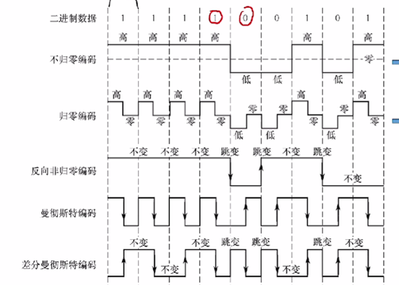
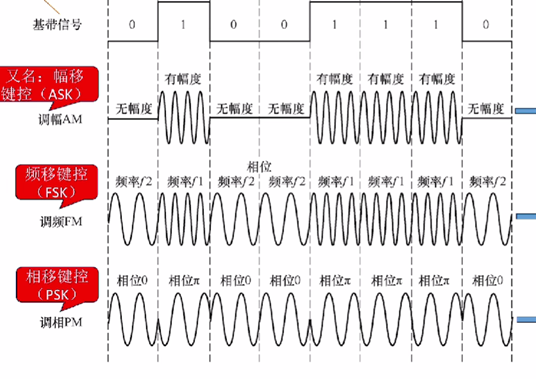

物理层研究相邻两台通信实体之间如何通过传播介质传递消息

并向数据链路层透明传输比特流

物理层内容：

传输介质：同轴电缆 光纤 电线

传输设备：电脑 中继器 集线器 交换机

传播方向：单工 半双工 全双工

四大特性：

机械特性：接口形状大小 引脚排列数量

电气特性：电压大小 传输速率

功能特性：每条线上数据的编码

过程特性：建立连接 释放连接的先后顺序

消息 比特流->信号

信号：数字信号 模拟信号

调制：信号的可逆转换 使得转换后的信号适合在信道上传输

基带调制：数字信号->数字信号 编码

每个bit管理这个时间段的[x,y)

RZ 维持一半时间后归零 高正低负

NRZ 维持的时间是整个时间段

NRZI 根据上一个为基准 1则开头不跳 0则开头跳

MC 中间跳变 下降沿0 上升沿1

DMC 根据上一个为基准 1则开头不跳 0则开头跳 中间必定跳变

带通调制：使用载波改变信号频率范围

AM amplitude-shift ASK

QAM Quadrature Amplitude Modulation

FM frequency-shift FSK

PM phase-shift modulation PSK

 

传输速率：

一个波可以离散成多种信号？从而编码成多少bit？

码元速率最多为两倍带宽

每个码元携带n个bit

对应信号数量2n 所以对应n个信号 每个码元携带了log2n个比特

奈奎斯特定理 无噪声有限信道:Vmax=2Blog2V

香农定理 有噪声有限信道：Vmax=Blog（1+S/N）

Db=10log10S/N

复用技术

FDM: Frequency Division Multiplexing（频分复用）

TDM: Time Division Multiplexing（时分复用）

STDM: Statistical Time Division Multiplexing（统计时分复用）

WDM: Wavelength Division Multiplexing（波分复用）

CDMA Code Division Multiplex Access 

发送0或1 如果编码序列长n 那么最多产生n个彼此正交的向量 用这些向量编码